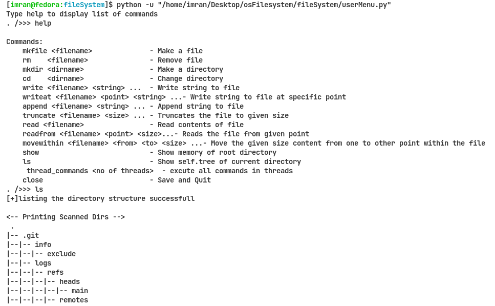

# VirtualFileSystem

Multi threaded file system implementation in python

## Run for multi threading 

Run the commandsThreading.py to execute commmands as threads from the **threads/inputthread.txt** 

- this multi threaded system will allocates the commands to the threads

- **outputThread<x>.txt** will be generated
- where x is number of thread
- It includes the output of specific thread

## Run for single user

Run the userMenu.py commands to manually give commands

- This will allow user to enter commands manually and perform operations
- NOTE: please uncomment the last two lines of code in userMenu.py in oder to run it for single user

``sampleUser = UserRequest();
sampleUser.userInput()``

 
 

