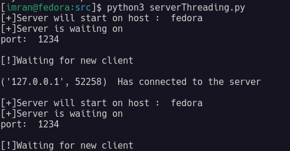
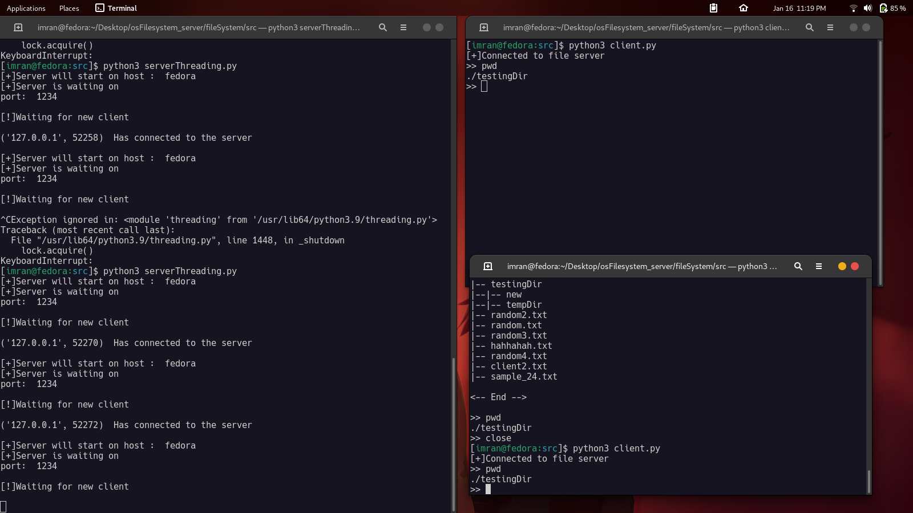
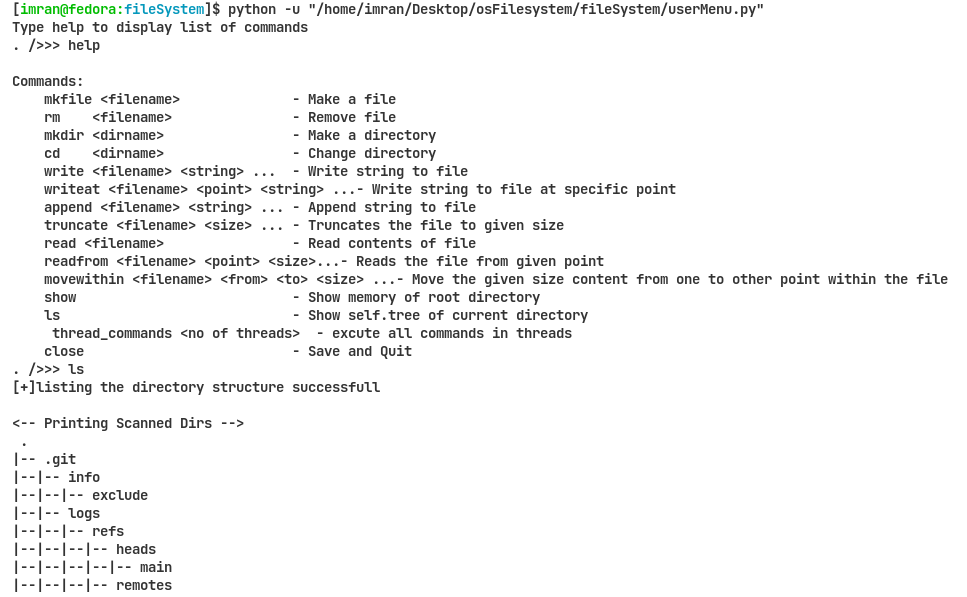

# VirtualFileSystem

Multi threaded file system implementation in python

## Description

Multi threaded filesystem server is implemented in python. Multiple clients can be connected at a time.

## Getting Started

### Dependencies

* python3
* Linux

### Installing and Running

* Clone the repo
```
git clone https://github.com/imranzaheer612/virtualFileSystem.git
```
* simply run the serverThreading.py on the server end

<br>




* Then start the clients. client.py contains the code for the client end





## License

This project is licensed under the [MIT] License - see the LICENSE.md file for details





